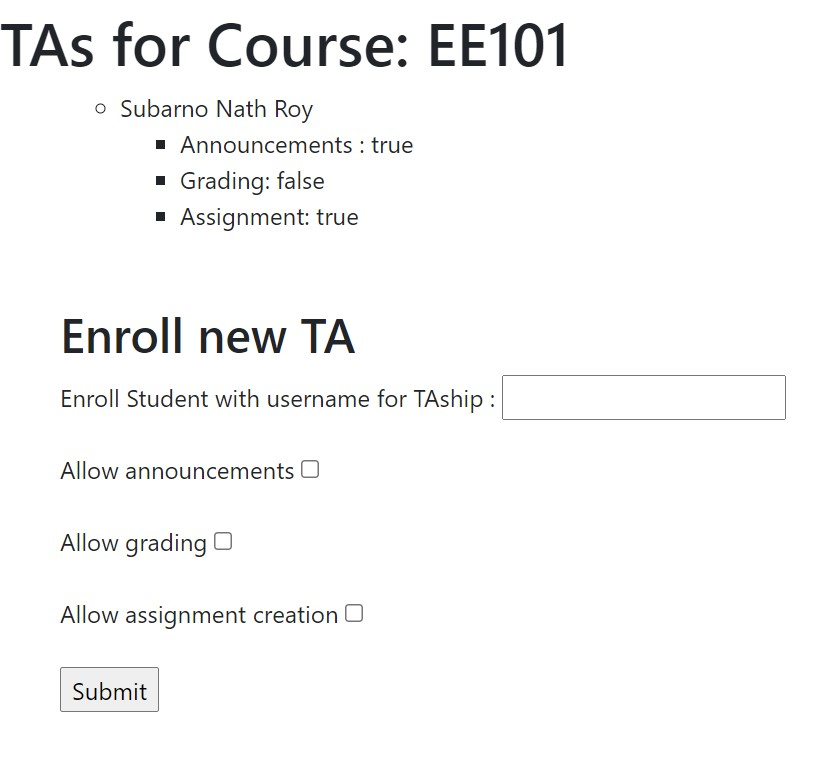

# Blackhat foodle
A dynamic learning environment using Express, MongoDb, NodeJS 

# Key Features

## Sign Up and Sign In 
You can create a new account or login into your already existing account either as an instructor or a student.  
  
You can also update your name and email address after making your account.  
Additionally, a link is sent to your email address if you wish to update your password.

## Courses
As an instructor, you can create new courses and enroll students for it or invite all students to enroll via email.  
Within courses you can add announcements and post within discussion forums. You can also disable forums during exams to prevent cheating.  
  
You can also enroll TAs for your courses and choose to give them privileges flexibly like making announcements, creating and grading assignments.   
   
A student can see his enrolled courses and the percentage of a course completed by him.
  

## Assignments
Instructors can create new assignments within courses and view all submissions to grade. An assignment will also have a specified weightage and deadline and instructor will be warned if the submission is late.  
   
The instructors are also shown a To-Do list of all submissions left to grade while students are shown lists of assignments left to submit. 

## Grades 
Instructor can grade each student manually or can upload grades and feedback in a CSV file downloaded with submissions.  
    
Instructors can also submit an autograding Python script which should output a grade on reading student's submission file as a command line argument.

